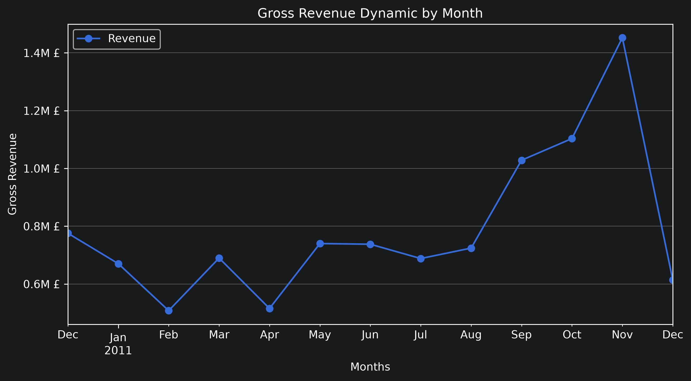
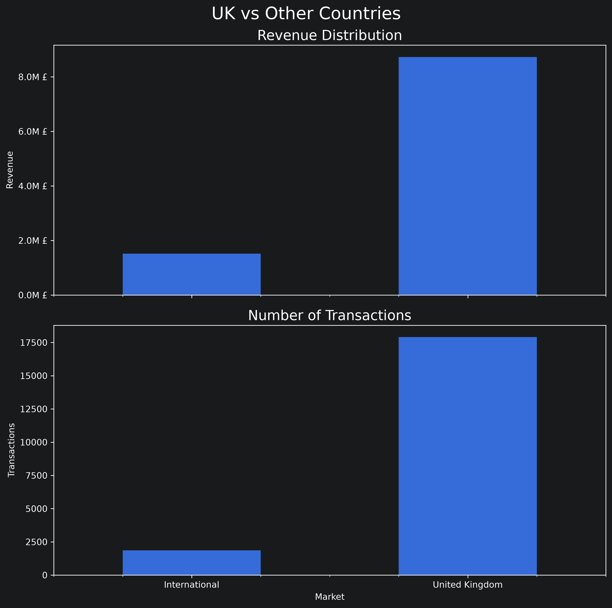
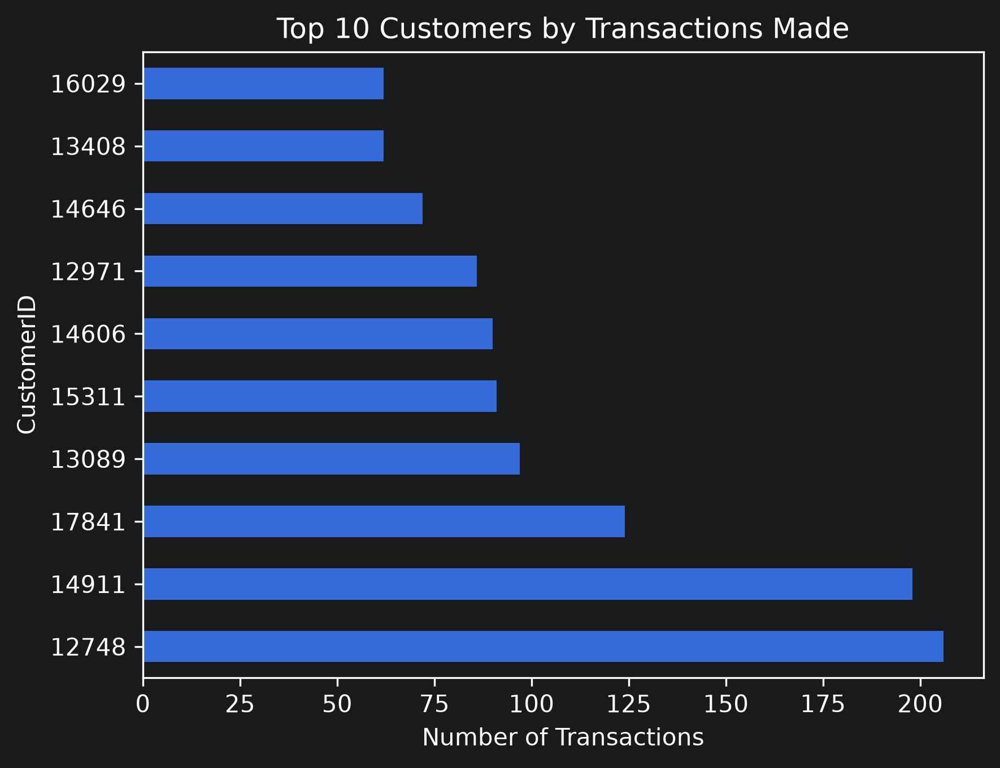
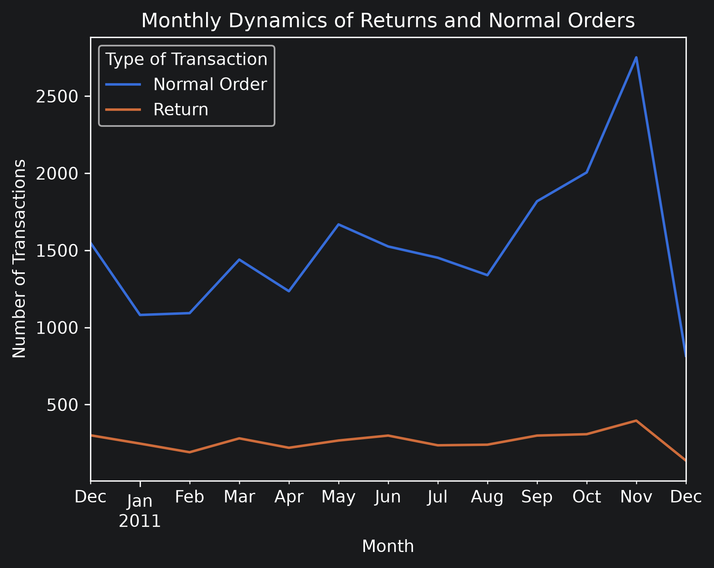

# Online Retail Analysis


A comprehensive exploratory analysis of more than **500,000 retail transaction records**, covering revenue dynamics, geographic markets, product performance, customer behavior, and returns.

The project uses the **Online Retail** dataset from the [UCI Machine Learning Repository](https://archive.ics.uci.edu/dataset/352/online+retail), containing transactions from a UK-based non-store retailer between **December 2010 and December 2011**.

---

## Explore the Analysis

The complete analysis is available in two formats:

- **Interactive HTML Report** — recommended for convenient exploration of the full analysis, with a persistent interactive table of contents for easy navigation.
- **Jupyter Notebook** — the original notebook containing the complete analysis, Python code and outputs.

The HTML report is generated directly from the Jupyter Notebook using `nbconvert` and enhanced with custom HTML, CSS and JavaScript to provide an automatically generated interactive navigation panel based on the notebook's section structure.

---

## Project Objective

This project was developed as a **portfolio project** to strengthen my practical data analysis skills and demonstrate my ability to work with a large real-world transactional dataset using Python and pandas.

The objective was not to answer a single predefined business question, but to build a broad understanding of the store's activity through a complete exploratory workflow — from initial data inspection and cleaning to detailed investigation of revenue, markets, products, customers, returns, and unusual observations.

The project focuses not only on calculating metrics, but also on interpreting them in context, comparing alternative measures, investigating anomalies, and determining which conclusions are actually supported by the available data.

---

## Key Business Questions

The analysis focuses on five main business questions:

- How do the store's **revenue and sales activity develop over time**, and what growth, decline or seasonal patterns can be identified?
- How is the store's activity distributed between the **domestic and international markets**, and which countries form its core trading relationships?
- Which **products** contribute most strongly to the store's performance, and how diversified and stable is product demand?
- Who are the store's **most important customers**, and what purchasing patterns characterize its strongest buyers?
- How significant are **returns and unusual transactions**, and to what extent do they affect the interpretation of the store's overall performance?

---

## Tools & Technologies

**Core tools**

- Python
- pandas
- NumPy
- Matplotlib
- Jupyter Notebook
- PyCharm

**Techniques used throughout the project**

- Data cleaning and preparation
- DataFrame construction and transformation
- Feature and derived-column creation
- Boolean filtering and conditional selection
- Missing-value analysis
- Grouping, aggregation and transformation
- Pivot tables
- Time-series resampling
- Datetime manipulation
- Quantile and distribution analysis
- Ranking and sorting
- Customer- and product-level aggregation
- Correlation analysis
- Outlier and anomaly investigation
- Data visualization
- Comparative analysis across time periods and market segments

---

## Analysis Scope & Methodology

The project follows a broad exploratory approach. Each major area begins with a high-level examination of the relevant metrics before moving into more detailed investigation whenever unusual patterns or anomalies are identified.

Different analytical questions require different subsets of the original data. For this reason, cleaning decisions are applied according to the purpose of each analysis rather than forcing every observation into a single universally cleaned dataset.

The analysis is divided into five main areas:

### Revenue Performance
Analysis of monthly revenue, transaction activity, revenue distributions, unusual monthly declines, late-year growth, and the relationship between transaction volume and overall revenue.

### Geographic Analysis
Comparison of domestic and international trade, identification of the strongest foreign markets, and investigation of the stability of international trading relationships over time.

### Product Analysis
Evaluation of products through three complementary perspectives: **quantity sold, transaction frequency, and revenue generated**, followed by investigation of temporal stability and unusual product-level observations.

### Customer Analysis
Identification of the most active and highest-revenue customers, examination of their purchasing patterns, geographic structure, favorite products, and contribution over time.

### Returns Analysis
Comparison of returns with regular transactions, followed by geographic, product-level, customer-level, and temporal analysis of return activity.

The complete analysis is available in both the **[interactive HTML report](online_retail_analysis.html)** and the original **[Jupyter Notebook](online_retail_analysis.ipynb)**.

---

## Business Overview & Key Findings

The analysis reveals a **predominantly volume-driven retail business** with a strong domestic market, a diversified product portfolio and a relatively stable group of high-value customers. The store demonstrates positive sales momentum toward the end of the analyzed period, while returns remain limited in relation to its overall commercial activity.

### Revenue & Sales Dynamics

The store generates most of its revenue through **sales volume rather than exceptionally expensive individual products**.

Revenue performance strengthens considerably toward the end of 2011. The period from **September to November shows particularly strong growth**, culminating in November — the final complete month in the dataset — which records the strongest overall performance.

The available nine days of December also indicate substantial activity, although the incomplete month prevents a direct comparison with previous full months.

Sales additionally exhibit **seasonal behavior**. The product mix changes toward the end of the year, with Christmas- and holiday-related products becoming more prominent in November and December. Consequently, part of the late-year increase in activity may reflect seasonal demand rather than purely underlying business growth.



### Geographic Structure

The business is strongly concentrated in its domestic market. The **United Kingdom accounts for 86.19% of total revenue and 90.61% of all transactions**, making it the clear foundation of the store's commercial activity.

International trade represents a considerably smaller part of the business, but international transactions generally exhibit a **higher-value structure** than domestic transactions.

Despite sales reaching **35 international markets**, international activity is concentrated around a relatively small and persistent group of countries. **Germany, France, EIRE and Belgium** consistently appear among the store's major international trading partners across different periods, indicating a stable core of foreign markets.



### Products & Customers

The analysis does not reveal a simple negative relationship between **product price and purchased quantity**. Higher prices do not systematically correspond to lower purchasing volumes within the observed data.

Similarly, no single definition of the store's **"best product"** emerges from the analysis. Different products perform strongly according to different measures — including revenue, quantity sold and transaction frequency — suggesting that the business benefits from a relatively broad product portfolio rather than depending entirely on a small number of universal best sellers.

Customer activity is more concentrated. A group of **persistent high-value customers** repeatedly appears among the leading contributors, and several of these customers demonstrate recurring purchasing patterns involving the same or similar products.

Most major customers are also located in the **United Kingdom**, further reinforcing the importance of the domestic market.

At the same time, the available transaction data does not reveal clear evidence of systematic preferential pricing or discounts for the store's strongest customers.



### Returns

Returns represent a **relatively small and structurally distinct part of the store's overall activity** and do not appear to constitute a major systematic burden on its commercial performance.

The number of returns generally develops alongside overall transaction activity: periods with more regular orders also tend to contain more return transactions. However, the financial value of returns is considerably less predictable and depends more heavily on the quantities and prices involved in individual return events.

Return activity also contains occasional extreme cases capable of strongly affecting product-, customer- and revenue-level statistics. These cases are examined separately in the full analysis and are particularly important when interpreting outliers and aggregated metrics.


---

## Analytical Takeaways & Recommendations

One of the clearest lessons from the project is that **individual metrics can produce misleading conclusions when interpreted in isolation**.

A product leading by total quantity sold may owe its position to a single unusually large transaction. A high-revenue customer may purchase relatively infrequently, while the most frequent customer may not generate particularly high revenue. Similarly, large absolute numbers of returns in the United Kingdom must be interpreted in the context of the UK's overwhelming share of total transactions.

For this reason, the analysis repeatedly combines:

- multiple performance metrics;
- temporal comparisons;
- distributional analysis;
- and investigation of individual extreme observations.

Several practical recommendations follow from the results:

- **Monitor late-year performance across additional years** to determine how much of the September–November growth is structural and how much is seasonal.
- **Maintain relationships with the core group of high-value and high-frequency customers**, as their activity contributes consistently to the store's performance.
- **Track products across several metrics simultaneously** rather than relying only on quantity or revenue rankings.
- **Continue monitoring the strongest international markets**, particularly where transaction values are substantially higher than in the domestic market.
- **Investigate unusually large purchases and returns operationally**, since isolated extreme events can significantly distort aggregate statistics.
- Improve the recording of **return reasons, discounts, operational charges, and unusual transaction types** to enable more reliable future analysis.

---

## Data Limitations

Several limitations should be considered when interpreting the results.

- **Limited observation period:** The dataset covers approximately one year, making it difficult to distinguish long-term growth from seasonality or temporary changes in demand.

- **Incomplete December 2011:** The dataset ends on December 9. December therefore contains only nine days of observations and cannot be directly compared with complete months.

- **Extreme and potentially erroneous transactions:** Several exceptionally large purchases and returns strongly affect product-, customer-, and revenue-level statistics. Examples include extremely large transactions involving products such as **PAPER CRAFT, LITTLE BIRDIE** and **MEDIUM CERAMIC TOP STORAGE JAR**. The dataset does not provide enough context to determine whether such events represent genuine bulk orders, human mistakes, system errors, or another type of activity. These observations can distort rankings, distributions, and visualizations if they are not investigated separately.

- **Unknown return reasons:** Returns can be identified, but the dataset does not explain why they occurred. Product issues, ordering mistakes, customer behavior, logistical problems, and other causes therefore cannot be distinguished.

- **Limited geographic context:** International transactions tend to have higher values, but the reasons cannot be determined from the dataset. Possible influences such as shipping costs, taxation, duties, or other operational factors cannot be reliably connected with individual purchases.

- **Limited customer information:** Customers are represented primarily through anonymous identifiers and transaction histories. Their business type, motivations, demographic characteristics, and purchasing context are unknown.

- **Unclear discount structure:** The dataset does not explicitly identify standard prices, customer-specific discounts, or commercial agreements. Differences in observed unit prices therefore cannot always be interpreted reliably as discounts.

- **Ambiguous operational and adjustment records:** Several non-standard `StockCode` values appear to represent operational entries, charges, adjustments, or other non-product transactions. Records with unusual characteristics, including negative prices, also occur. Their exact accounting or operational meaning is not always documented, limiting the certainty with which these observations can be interpreted.

---

## How to Run

1. Clone this repository:

```bash
git clone https://github.com/vanitskiy18/online-retail-analysis.git
cd online-retail-analysis
```

### 2. Install the required Python packages:

```bash
pip install pandas numpy matplotlib openpyxl jupyter
```

### 3. Download the Online Retail dataset from the [UCI Machine Learning Repository](https://archive.ics.uci.edu/dataset/352/online+retail) and place the downloaded file in the following directory:
```text
data/Online Retail.xlsx
```

### 4. Open and Run

```text
online_retail_analysis.ipynb
```

### 5. To generate the browser-friendly HTML report with interactive navigation, run:

```text
python build_html.py
```

---

## Author

**Arseniy Vanitskiy**

University of Warsaw  
Faculty of Economic Sciences

---

## License

This project is licensed under the **MIT License**.
